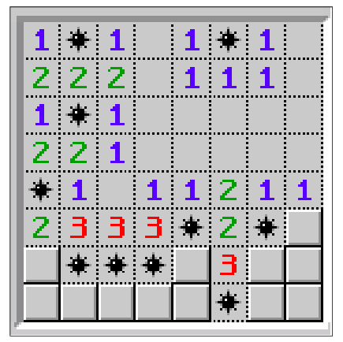
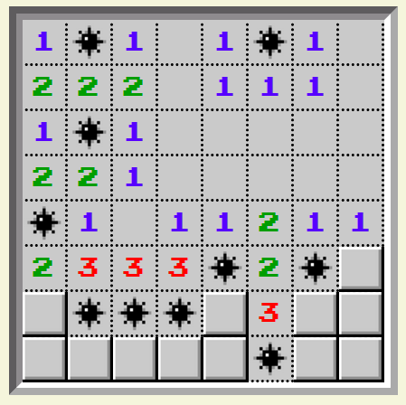

# flexbox-minefield
Challenge: Flexing your CSS muscles

https://oliviercharlier.github.io/flexbox-minefield/

Campus.
Goal : obtenir le même résultat que l'image proposée (le jeu Démineur (Minefield) niveau débutant d'un joueur ayant perdu sa partie. Boooooh NOOOOB !!! :D) en utilisant FLEXBOX.
Work :4HOO learning
Result : OK
Bonus (use HOVER) : OK

Finaly: Happy ! It works!

Oli

Goal:

Result:

